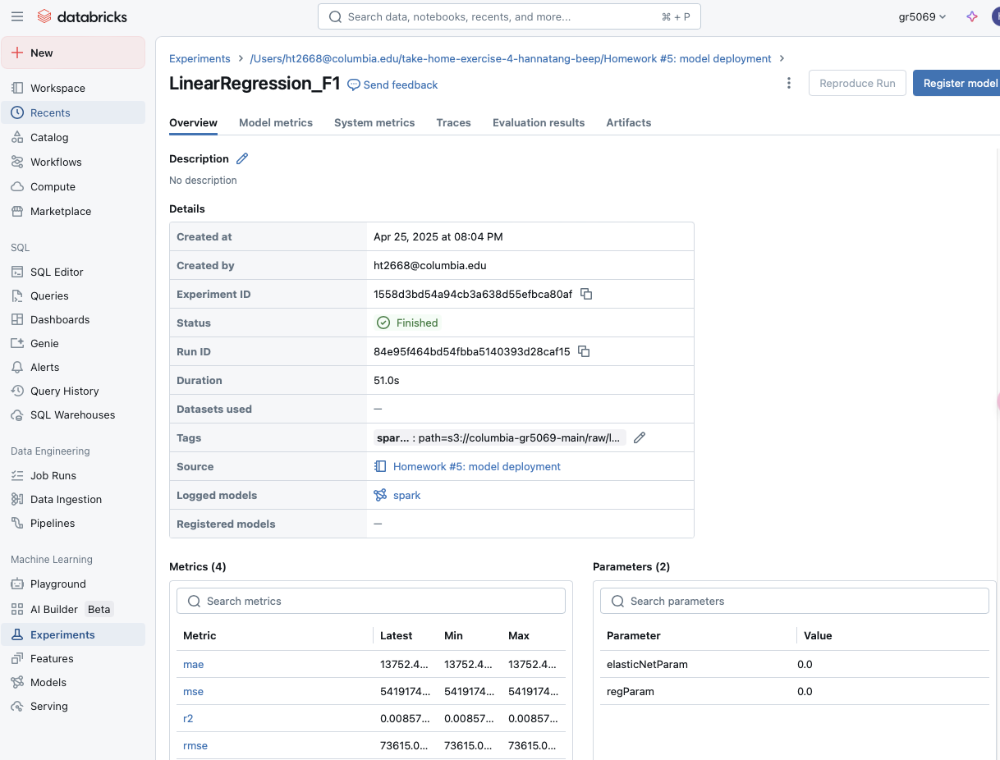

# Homework #5: Model Deployment

This assignment demonstrates building, evaluating, and deploying two predictive regression models using the F1 dataset in Databricks.

## 📊 Models Implemented
- **Linear Regression** (`LinearRegression_F1`)
- **Random Forest Regressor** (`RandomForest_F1`)

Both models predict lap time (`milliseconds`) using features such as lap number and position.

---

## 🔁 MLflow Tracking
For each model, we tracked the following using MLflow:
- **Parameters** (e.g., regParam, numTrees)
- **Metrics**: RMSE, MAE, R², and MSE
- **Model Artifact**: full Spark model
- **Additional Artifact**: model summary (LR) or feature importances (RF)

📸 See MLflow screenshots below:

### Linear Regression MLflow Run  

### Random Forest MLflow Run  

---

## 🗄️ Prediction Storage (MySQL)
Each model's predictions were written to my own AWS RDS MySQL instance:
- `gr5069.lr_predictions_f1`
- `gr5069.rf_predictions_f1`

---

## 🧠 Environment
- Databricks (Spark 3.5.0)
- MLflow (Databricks native)
- AWS RDS (MySQL 5.7)

---

## ✅ Submission Summary

| Rubric Item | Status |
|-------------|--------|
| Create tables for each model | ✅ Done |
| MLflow experiment logging | ✅ Done |
| Save predictions into own DB | ✅ Done |
| GitHub submission | ✅ Done |

---

## 📂 Files
- `Homework #5: model deployment` (Databricks notebook)
- `images/mlflow_linear_regression_run.png`
- `images/mlflow_random_forest_run.png`
